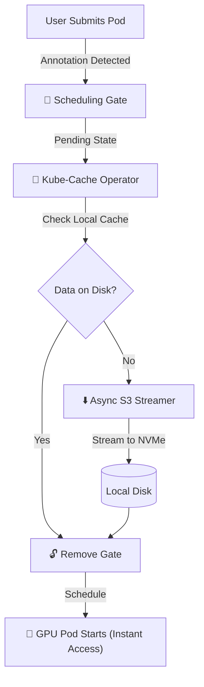
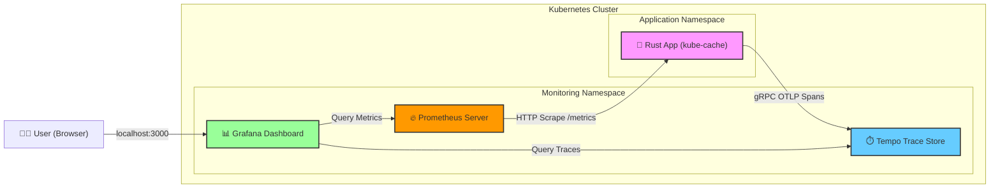

# ⚡ Kube-Cache: The JIT Data Pre-Warmer for Kubernetes


## 💡 The Problem: The "GPU Tax"
In deep learning infrastructure, the most expensive resource is GPU time (approx. **$4/hr for an H100**).
When a training Pod starts, it typically spends the first 10-30 minutes initializing and downloading terabytes of datasets from object storage (S3/GCS).

**The Result:** The GPU sits idle at 0% volatile utilization while the meter is running. This "Data Loading Tax" wastes millions of dollars annually at scale.

## 🛠 The Solution
**Kube-Cache** is a Kubernetes Operator written in Rust that eliminates this idle time using the **Delegation Pattern** and **Scheduling Gates**.

It intercepts Pods *before* they are scheduled, downloads the data to the node's local NVMe using a high-performance async Rust worker, and only releases the Pod to the scheduler once the data is locally available.

### 🏗 Architecture


### 📡 Observability Pipeline

This project uses a push-based approach for traces and a pull-based approach for metrics, consolidated in Grafana.



### 🚀 Key Engineering Features

1. **High-Performance Rust Core**
   - **Async Stream Processing**: Replaced Python/Bash scripts with `tokio` and `aws-sdk-s3`. Data is streamed directly from S3 body to disk with constant memory footprint, saturating the network interface without blowing up RAM.
   - **Safety**: Leveraged Rust's type system to handle concurrent Pod watches and patch operations without race conditions.

2. **Advanced Kubernetes Patterns**
   - **Scheduling Gates (Non-Destructive Pausing)**: Instead of using InitContainers (which occupy the node and block the GPU), we use the K8s v1.26+ `schedulingGates` API. The Pod exists in the API server but does not consume resources until we release it.
   - **Controller Pattern**: A persistent event loop watches for changes in Pod state, ensuring eventual consistency even if the operator restarts.

3. **Production-Grade Observability**
   - The system implements a full SRE Stack (Grafana, Tempo, Prometheus) to visualize internal performance.
   - **Distributed Tracing (OpenTelemetry)**: Every S3 download is instrumented. We can visualize the "Waterfall" of CPU Decryption vs. Network I/O latency.
   - **Structured Logging**: JSON-formatted logs allow for automated parsing and alerting.
   - **Metrics**: Prometheus endpoints track Cache Hit/Miss rates and download speeds.

4. **Optimized Deployment**
   - **Multi-Stage Docker Build**: The final image is a stripped-down `debian:bookworm-slim` containing only the binary.
   - **Cross-Compilation**: The build pipeline uses `rust:bullseye` (older libc) to ensure the binary runs on any Kubernetes node (Ubuntu, Bottlerocket, COS) without GLIBC errors.

## 💻 How to Run

### Prerequisites
- Kubernetes Cluster (Kind, EKS, or GKE)
- `kubectl`
- `docker`

### 1. Deploy the Infrastructure
```bash
# 1. Build the Optimized Operator Image
docker build -t kube-cache:v4 .
kind load docker-image kube-cache:v4

# 2. Deploy Observability Stack (Tempo, Grafana, Prometheus)
kubectl apply -f monitoring.yaml

# 3. Deploy the Operator
kubectl apply -f deploy.yaml
```

### 2. Trigger a Download
Create a Pod with the required annotation to trigger the gate:

```yaml
apiVersion: v1
kind: Pod
metadata:
  name: gpu-training-job
  annotations:
    "x-openai/required-dataset": "s3://models/gpt-4-weights"
spec:
  schedulingGates:
    - name: "kube-cache.openai.com/gate"
  containers:
    - name: cuda-container
      image: nvidia/cuda:12.0-base
      command: ["/bin/sh", "-c", "echo Training started on local data... && sleep 3600"]
```

### 3. View the Traces
1. Forward the Dashboard:
   ```bash
   kubectl port-forward svc/grafana -n monitoring 3000:80
   ```
2. Open Explore in Grafana.
3. Select Tempo and search for traces to see the S3 download breakdown.

## 🔮 Roadmap

### P2P Weight Distribution (The "Hyper-Scale" Layer)
**Problem:** 1,000 nodes downloading the same 70GB file simultaneously causes S3 throttling ("Thundering Herd").

**Plan:** Implement a BitTorrent-style layer where nodes discover peers via Gossip protocol and share file chunks over the internal cluster network, bypassing S3.

### Predictive Pre-caching (The "Intelligence" Layer)
**Problem:** Reactive caching still incurs latency for the first pod.

**Plan:** Integrate with Prometheus metrics to detect traffic spikes (e.g., "9am Login Rush"). The operator will proactively pre-warm idle nodes with weights before the Autoscaler even spins up the new Pods.

## ⚠️ Known Limitations

### GPU Observability on WSL2
The GPU uprobe (`cudaLaunchKernel`) is implemented in the `sentry-ebpf` crate but **remains inactive when running on WSL2**.
- **Reason:** The Linux Kernel cannot attach `uprobes` to files projected via `virtio-fs` (the mechanism used to mount Windows drivers into WSL2 instances). The `perf_event_open` syscall fails with an error when targeting the NVIDIA driver shim (`libcuda.so.1`) located in `/usr/lib/wsl/lib`.
- **Requirement:** This feature requires a native Linux host or a bare-metal Kubernetes cluster where the NVIDIA drivers are on a standard ext4/xfs filesystem.
