# Sentry: eBPF Kernel Observability Agent

**Sentry** is a high-performance, zero-overhead observability agent built in **Rust**. It uses **eBPF (Extended Berkeley Packet Filter)** to hook directly into the Linux Kernel, capturing microsecond-level metrics for Network Latency and Disk I/O without requiring any changes to the target applications (sidecar-less).

```mermaid
graph TD
    subgraph KERNEL["🟥 Kernel Space (eBPF)"]
        Target[("Target App (Pods)")]
        subgraph Probes
            NetProbe["🔌 kprobe/tcp_connect"]
            DiskProbe["💾 tracepoint/block_rq_complete"]
        end
        Map[("📦 eBPF Map (RingBuffer)")]
    end

    subgraph USER["🟦 User Space (Rust)"]
        Agent["🦀 Sentry Agent"]
        Loop["⚡ Async Event Loop"]
        Metrics["📊 /metrics Endpoint"]
    end

    subgraph OBS["🟩 Observability Stack"]
        Prom["🔥 Prometheus"]
        Graf["💹 Grafana"]
    end

    Target -->|Syscalls| NetProbe
    Target -->|Block I/O| DiskProbe
    NetProbe -->|Write Event| Map
    DiskProbe -->|Write Event| Map
    
    Map -->|Poll| Agent
    Agent -->|Process| Loop
    Loop -->|Expose| Metrics
    
    Prom -->|Scrape| Metrics
    Graf -->|Query| Prom

    classDef kernel fill:#ffe6e6,stroke:#ff3333,stroke-width:2px;
    classDef user fill:#e6f3ff,stroke:#3366ff,stroke-width:2px;
    classDef obs fill:#e6fffa,stroke:#00cc99,stroke-width:2px;

    class Target,NetProbe,DiskProbe,Map kernel;
    class Agent,Loop,Metrics user;
    class Prom,Graf obs;
```



## 🚀 Why This Exists
Traditional observability tools (sidecars) introduce latency and consume user-space resources. Sentry solves this by moving collection to the **Kernel Space**, allowing for:
* **Zero Instrumentation:** Trace any binary (Go, Python, Java) without recompiling.
* **Zero Copy:** Metrics are aggregated in kernel maps and read efficiently by userspace.
* **Safety:** Verified by the Linux Kernel to ensure no crashes.

## 🛠️ Tech Stack
* **Language:** Rust (Tokio Async Runtime)
* **Kernel:** eBPF (using `Aya` library for CO-RE)
* **Infrastructure:** Kubernetes (Kind), Docker
* **Visualization:** Prometheus & Grafana

## 🧠 Key Technical Features

### 1. Network Probe (`kprobe/tcp_connect`)
Instead of parsing logs, Sentry hooks the kernel's TCP stack to measure the exact duration of connection handshakes.
* **Mechanism:** Attaches to `tcp_connect` (entry) and `tcp_rcv_state_process` (exit).
* **Impact:** Captures sub-millisecond latency spikes invisible to standard sidecars.

### 2. Disk I/O Probe (`tracepoint/block_rq_complete`)
Tracks physical disk throughput by intercepting block device completion events.
* **The "War Story" (WSL2 Support):**
    * *Challenge:* Standard `vmlinux` bindings failed on WSL2 (Kernel 6.6) due to driver differences.
    * *Solution:* Reverse-engineered the kernel debug format files (`/sys/kernel/debug/tracing/...`) and identified that tracepoint arguments were flattened. Manually implemented a raw memory read at **Offset 24** to capture accurate sector counts.

### 3. GPU Probe (Experimental)
Designed to track `cudaLaunchKernel` calls to detect GPU starvation.
* *Status:* **Implemented but blocked on Infrastructure.**
* *Limitation:* The WSL2 architecture projects NVIDIA drivers via `virtio-fs` shims, which prevents standard `uprobe` attachment. The code (`gpu.rs`) is valid for native Linux hosts but is disabled in the current demo environment.

## 📊 Performance Characteristics
Sentry is designed for production scale:
* **CPU Overhead:** < 1% (Event filtering happens in kernel).
* **Memory Footprint:** Fixed allocation via BPF Maps (~160KB per node).
* **Safety:** Uses per-CPU ring buffers to avoid lock contention.

## 🏃‍♂️ Quick Start

### Prerequisites
* WSL2 (Ubuntu 22.04+) or Native Linux
* Rust 1.75+
* Docker & Kind

### Deployment
```bash
# 1. Build the Agent
docker build -f sentry/Dockerfile -t sentry:v6 .

# 2. Load into Cluster
kind load docker-image sentry:v6

# 3. Deploy
kubectl apply -f deploy-sentry.yaml
```

## ⚠️ Known Limitations
* **WSL2 GPU Tracing:** As noted, uprobes on libcuda.so are currently incompatible with the WSL2 driver projection model.
* **Map Size:** Fixed size (1024 entries) for connection tracking; old entries are evicted under extreme load (LRU logic planned).
